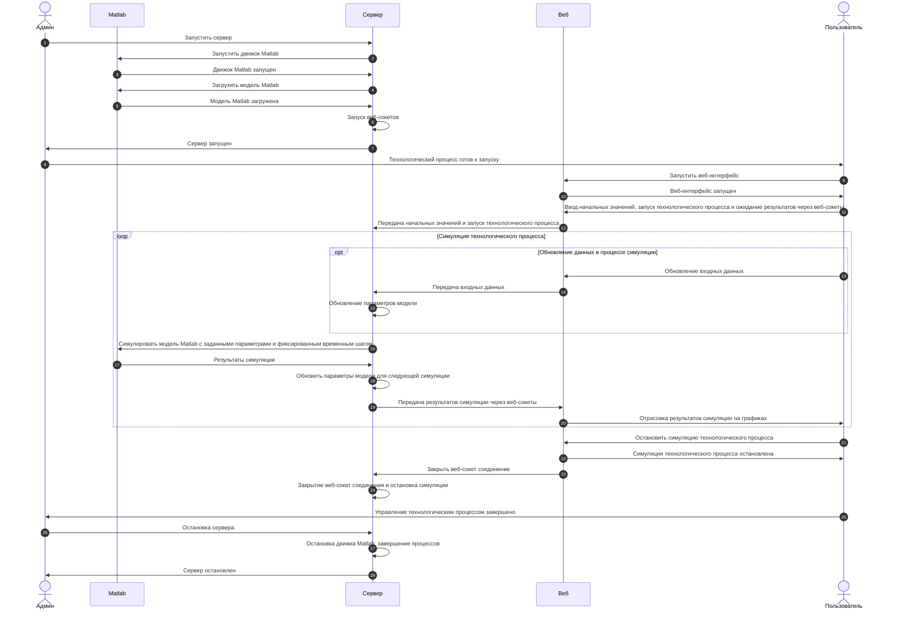

# Дистанционное управление химическим технологическим процессом

За основу взят пример: ["Неадиабатический реактор с резервуаром непрерывного перемешивания: моделирование в файле MATLAB с имитациями в Simulink."](https://www.mathworks.com/help/ident/ug/non-adiabatic-continuous-stirred-tank-reactor-matlab-file-modeling-with-simulations-in-simulink.html)  

## Структура файлов
- _idnlgreysim.m_ - скрипт Matlab для симуляции модели _cstr\_sim.slx_ на основе начальных данных. По сути является упрощенной версией модели _idnlgreydemo9.m_;
- _loadModel.m_ - скрипт Matlab для загрузки модели в оперативную память;
- _server.py_ - сервер, запускающий Matlab симуляцию, в ответ на события из веб-интерфейса;
- _web_ - каталог, содержащий исходный код веб интерфейса.

## Визуальное представление модели

## Схема взаимодействия

