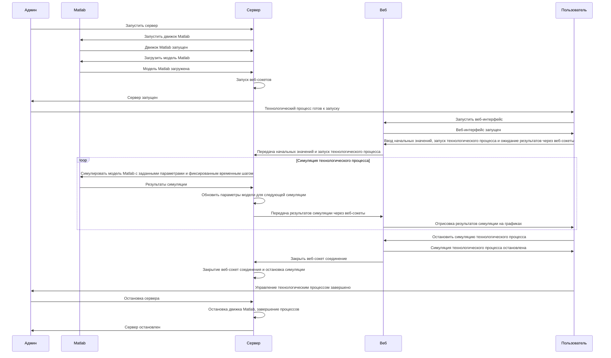

# Дистанционное управление химическим технологическим процессом

За основу взят пример: ["Неадиабатический реактор с резервуаром непрерывного перемешивания: моделирование в файле MATLAB с имитациями в Simulink."](https://www.mathworks.com/help/ident/ug/non-adiabatic-continuous-stirred-tank-reactor-matlab-file-modeling-with-simulations-in-simulink.html)  

## Структура файлов
- _idnlgreysim.m_ - скрипт Matlab для симуляции модели _cstr\_sim.slx_ на основе начальных данных. По сути является упрощенной версией модели _idnlgreydemo9.m_;
- _loadModel.m_ - скрипт Matlab для загрузки модели в оперативную память;
- _server.py_ - сервер, запускающий Matlab симуляцию, в ответ на события из веб-интерфейса;
- _web_ - каталог, содержащий исходный код веб интерфейса.

## Визуальное представление модели

## Схема взаимодействия

## Локальное использование
Для запуска локальной симуляции процесса необходимо установить [NodeJS v.18](https://nodejs.org/en/download/package-manager)  

1) Открыть первое окно терминала, запустить файл _server.py_ и дождаться загрузки сервера
2) Открыть второе окно терминала, перейти в каталог _web_ выполнив команду `cd web`
3) Во втором терминале выполнить команду `npm install && npm run start`, дождаться установки пакетов и запуска веб-сервера
4) В веб-браузере перейти на `http://localhost:3000`
5) Взаимодействовать с веб-интерфейсом
6) Остановить веб-сервер во втором терминале комбинацией клавиш `ctrl+c`
7) Остановить сервер в первом терминале комбинацией клавиш `ctrl+c`
